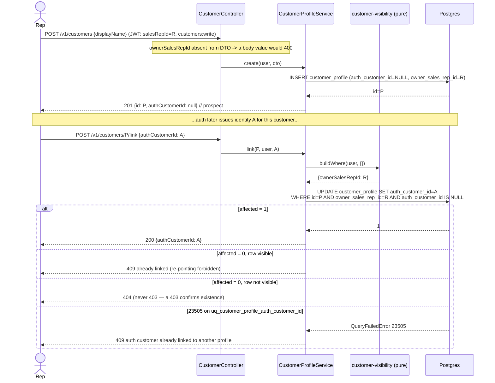

# Design: `customers` — Commercial Customer Registry for Sales Reps

**Change slug**: `sales-rep-commercial-cycle` · **Phase**: sdd-design · **Base**: `origin/main` @ `3de05df`
**Artifact store**: hybrid (Engram `sdd/sales-rep-commercial-cycle/design` + this file)

## Technical Approach

One new bounded context `src/modules/customers/**` at **thin-CRUD depth**, structurally cloned from
`suppliers` (`provider-branch.service.ts`) and behaviourally cloned from `quotes` (pure `domain/*.ts` rule
modules + `@CurrentUser()`-scoped service). Two tables in a new `customers` schema, one hand-written
migration. Invariants are enforced in **three layers, deliberately**: a pure guard (clear error), a service
transaction (atomicity), and a DB constraint (final arbiter under concurrency).

## Architecture Decisions

### D1 — Layer depth: thin CRUD + pure rule modules, no aggregate

| Option | Tradeoff | Verdict |
|---|---|---|
| Thin CRUD + pure `domain/*.ts` rule modules | Matches `quotes` (the newest visibility-bearing module in main) and `suppliers`. Rules are unit-testable with zero mocks. | **Chosen** |
| Rich aggregate + repository port, like `inventory` | Symmetry only. | Rejected |
| Rules inlined in the services | Guarantees drift between `list()` and `findById()` — the exact reason `quote-visibility.ts` exists. | Rejected |

**Rationale**: `inventory` earns its aggregate with an arithmetic invariant (`reserved <= stock`) over a
mutable counter hit concurrently by several use cases. Neither of our invariants is of that kind:
*link-once* is a one-way transition on a single row (a compare-and-set `UPDATE`), and *exactly one main
branch* is a **cross-row** constraint an aggregate loaded from one row physically cannot see. An aggregate
here would hold zero enforceable invariants and would still need the DB index. The invariants do get a
single home — two pure modules — just not an object graph.

### D2 — Visibility: copy `quote-visibility.ts`, do not extract a shared helper

**Choice**: new `customers/domain/customer-visibility.ts` with the same `buildWhere(user, query) →
FindOptionsWhere<T> | null` shape and the same `null` → empty-page / 404-not-403 contract.
**Rejected**: hoisting a generic `buildWhere` into `src/shared/`.
**Rationale**: the similarity is superficial. Quotes' version is welded to `QuoteStatus` and `validUntil`
expiry derivation and scopes rows by `salesRepId` + `customerId`; ours scopes by `ownerSalesRepId` +
`authCustomerId` and adds a tier quotes has no analogue for (`owner IS NULL` house accounts, admin-only).
Generalising over two unrelated entities needs a type-parameterised field-name map — more machinery than
the ~40 lines it saves, with no `src/shared/visibility` precedent. A `quotes → customers` import would also
couple two contexts that must stay independent. Extract when the follow-on orders retrofit gives a **third**
real call site to generalise against.

Tiers (most privileged first), mirroring the quotes ladder:

| Caller | `where` |
|---|---|
| `customers:admin` | `{}` — all rows, including `ownerSalesRepId IS NULL` |
| rep (`user.salesRepId` present) | `{ ownerSalesRepId: user.salesRepId }` |
| customer | `{ authCustomerId: user.id }` |
| filter that can never match | `null` → `paginated([], 0, query)` |

Emergent property worth stating: a prospect has `authCustomerId = NULL`, so the customer tier can never
match one. Prospect invisibility to customers is structural, not a rule to remember.

### D3 — Prospect link: single compare-and-set statement

`POST /v1/customers/:id/link` `{ authCustomerId }` →
`repo.update({ id, authCustomerId: IsNull() }, { authCustomerId })`. `affected !== 1` after a visibility
check ⇒ already linked ⇒ **409**; invisible/absent row ⇒ **404**. Precedent: `QuoteService.convert()` claims
the status with a CAS before doing work.
**Rejected**: read-then-write in a transaction (needs `SELECT ... FOR UPDATE` to be correct; CAS is one
statement and already the repo idiom for one-way transitions); an immutable-column trigger (invisible to the
app, untestable from Jest, no precedent).

### D4 — One main branch: transactional demote **plus** a partial unique index

Copy `demoteOtherMainBranches(tx, customerProfileId, exceptId?)` verbatim in shape, then add the hardening
`provider_branch` lacks. The index is not belt-and-braces — it is the only thing that works in the race:

Two transactions promote different branches of the same customer. Both `UPDATE ... WHERE
customer_profile_id = X AND is_main_branch = TRUE`; they serialise on the *existing* main row. But neither
demotes the other's **new** main, because at each one's scan time that row was still `FALSE` and was skipped
without being locked. Both then set `TRUE`. Without the index you silently get two main branches — which is
`provider_branch`'s state today. With it, the second transaction fails on the non-deferrable index check.

Handling: catch `QueryFailedError` with `code === '23505'` → `ConflictException('another branch was promoted
concurrently; retry')`. Precedent: `TypeOrmInventoryRepository.create`. No retry loop — this is a
human-speed action. Demote MUST be ordered before promote inside the transaction (the index is checked at
statement end, not at commit).

### D5 — Persistence and ID conventions

| Concern | Mapping |
|---|---|
| Both PKs | `UUID PRIMARY KEY DEFAULT gen_random_uuid()` → `@PrimaryGeneratedColumn('uuid') id!: string` — as `QuoteEntity` / `shipping.shipments`. **Not** the BIGINT + `bigintTransformer` of `provider_branch`; no `bigintTransformer` appears anywhere in this module. |
| Multi-schema | `@Entity({ schema: 'customers', name: 'customer_profile' \| 'customer_branch' })` — mandatory per CLAUDE.md. |
| Cross-service UUIDs | `auth_customer_id`, `owner_sales_rep_id` → `@Column({ type: 'uuid', nullable: true })`, **no FK**, doc-comment mirroring `QuoteEntity.customerId`. |
| Intra-service FK | `customer_branch.customer_profile_id → customer_profile(id) ON DELETE CASCADE`, `@ManyToOne` + `@JoinColumn({ name: 'customer_profile_id' })`. |
| Timestamps | `TIMESTAMP WITH TIME ZONE DEFAULT NOW() NOT NULL` + `@CreateDateColumn`/`@UpdateDateColumn({ type: 'timestamptz' })` **and** a `utils.set_updated_at` trigger per table. Both write `NOW()`; keep both (CLAUDE.md). |
| Money | None in this module — no `numericTransformer`. |

### D6 — Migration `1779738126227-AddCustomersSchema.ts`

Both uniqueness rules are **partial**, so they must be `CREATE UNIQUE INDEX ... WHERE ...`. Postgres has no
partial unique *constraint*; the proposal's "nullable unique `auth_customer_id`" is only expressible as an
index. This is the single most likely thing to get wrong.

```sql
CREATE UNIQUE INDEX uq_customer_profile_auth_customer_id
  ON customers.customer_profile(auth_customer_id) WHERE auth_customer_id IS NOT NULL;
CREATE UNIQUE INDEX uq_customer_branch_main
  ON customers.customer_branch(customer_profile_id) WHERE is_main_branch;
```
Plus `idx_customer_profile_owner_sales_rep_id`, `idx_customer_branch_profile_id`, and the two triggers.
`up()`/`down()` follow `AddShippingSchema1779738126224` exactly: `CREATE SCHEMA IF NOT EXISTS` +
`COMMENT ON SCHEMA`; `down()` drops triggers → `customer_branch` → `customer_profile` →
`DROP SCHEMA IF EXISTS customers CASCADE`.

**Timestamp provenance** — this executor has no shell, so `git ls-tree` could not be run. Verified from the
filesystem instead: the local checkout tops out at `...224` while already containing `stock-sync` (so
`stock-sync` shipped no migration), and the `notifications` worktree — same module set as `origin/main`
(quotes + notifications + stock-sync) — carries `...225-AddQuotesSchema` and `...226-AddNotificationsSchema`.
Max on `origin/main` is therefore `1779738126226`, and `...227` is free. **`sdd-apply` MUST re-verify** with
`git ls-tree -r --name-only origin/main -- src/shared/database/migrations` before writing the file.

### D7 — Ownership stamping: separate admin-only route, not a conditionally-stripped field

`CreateCustomerDto` **does not declare** `ownerSalesRepId`. The global `ValidationPipe`
(`whitelist + forbidNonWhitelisted`) therefore answers a body attempt with **400**, and the service stamps
`user.salesRepId`. Reassignment lives on `PATCH /v1/customers/:id/owner` `@Roles('customers:admin')`,
matching the repo's action-route style (`POST :id/send`, `:id/approve`).
**Rejected**: one DTO with an optional field the service strips for non-admins — once the field is declared,
a bug in the strip path is a silent privilege escalation; undeclared, the framework refuses it and there is
no strip path to get wrong.

### D8 — Module boundary

`CustomersModule` exports `CustomerProfileService` and `CustomerBranchService` — plain provider exports, as
`SuppliersModule` exports `ProviderService, ProviderBranchService`. **No `Symbol` port + adapter**: that
pattern is reserved in this repo for swappable implementations (`INVENTORY_REPOSITORY`,
`NotificationChannel`, `POLAR_CLIENT`, `STOCK_FEED_CLIENT`); a CRUD service has exactly one forever.

One purpose-built read exists for the follow-on orders change:
`CustomerProfileService.findByAuthCustomerId(authCustomerId): Promise<CustomerProfileEntity | null>` —
because `orders`, `sales`, `billing` and `quotes` all carry the **auth** id, not our surrogate `id`.
Entities and the TypeORM repository are **not** exported. `CustomersModule` imports nothing from `orders`,
so there is no cycle.

## Data Flow

```
HTTP  ──▶ CustomerController (@Roles, @CurrentUser)
            │
            ▼
          CustomerProfileService / CustomerBranchService     ── application/
            │            │
            │            └──▶ customer-visibility.buildWhere()   ── domain/ (pure)
            │            └──▶ customer-link.assertLinkable()     ── domain/ (pure)
            ▼
          Repository<T> / DataSource.transaction()
            │
            ▼
          Postgres  ── uq_customer_branch_main, uq_customer_profile_auth_customer_id  (final arbiter)
```

## Sequence: register a prospect, then link its auth id



## Sequence: promote a branch to main, under concurrency

```mermaid
sequenceDiagram
    participant A as TX-A (promote b1)
    participant B as TX-B (promote b2)
    participant DB as Postgres

    A->>DB: BEGIN
    B->>DB: BEGIN
    A->>DB: UPDATE ... SET is_main_branch=FALSE WHERE customer_profile_id=P AND is_main_branch AND id<>b1
    B->>DB: same demote (b2)
    Note over B,DB: blocks on the row lock A holds over the current main
    A->>DB: UPDATE customer_branch SET is_main_branch=TRUE WHERE id=b1
    A->>DB: COMMIT
    Note over B,DB: B wakes, re-checks: old main is now FALSE -> not demoted.<br/>b1 was FALSE in B's scan, so B never locked or demoted it.
    B->>DB: UPDATE customer_branch SET is_main_branch=TRUE WHERE id=b2
    DB-->>B: ERROR 23505 uq_customer_branch_main
    B->>DB: ROLLBACK
    Note over A,DB: exactly one main survives — enforced by the index,<br/>NOT by the demote (which provider_branch relies on alone)
    B-->>B: ConflictException 409 "another branch was promoted concurrently; retry"
```

## File Changes

| File | Action | Description |
|---|---|---|
| `src/modules/customers/domain/entities/customer-profile.entity.ts` | Create | UUID PK, nullable `authCustomerId` / `ownerSalesRepId`, `@Entity({schema:'customers'})` |
| `src/modules/customers/domain/entities/customer-branch.entity.ts` | Create | UUID PK, FK to profile, `ship_to_*`-shaped address columns |
| `src/modules/customers/domain/customer-visibility.ts` | Create | Pure `buildWhere` — admin / rep / customer / house-account tiers |
| `src/modules/customers/domain/customer-link.ts` | Create | Pure link-once guard + error message |
| `src/modules/customers/application/services/customer-profile.service.ts` | Create | CRUD, JWT stamping, CAS link, `findByAuthCustomerId` |
| `src/modules/customers/application/services/customer-branch.service.ts` | Create | CRUD, transactional `demoteOtherMainBranches`, `23505` → 409, delete-main blocked |
| `src/modules/customers/infrastructure/http/customer.controller.ts` | Create | `@Roles`/`@CurrentUser`; action routes before `:id` routes (Nest matches in declaration order) |
| `src/modules/customers/infrastructure/http/dto/customer.dto.ts` | Create | Create/Update/Query/Link/ReassignOwner DTOs |
| `src/modules/customers/customers.module.ts` | Create | Exports both services |
| `src/shared/database/migrations/1779738126227-AddCustomersSchema.ts` | Create | Hand-written SQL; timestamp re-verified at apply time |
| `src/app.module.ts` | Modify | Register `CustomersModule` |
| `db.md` | Modify | Document the `customers` schema |
| `src/modules/customers/**/*.spec.ts` | Create | Unit specs (see below) |
| `test/customers-constraints.e2e-spec.ts`, `test/customers.e2e-spec.ts` | Create | Testcontainers + supertest |

## Interfaces / Contracts

```ts
// customers/domain/customer-visibility.ts
export interface CustomerVisibilityQuery { ownerSalesRepId?: string; isActive?: boolean; search?: string }
export function buildWhere(
  user: AuthenticatedUser,
  query: CustomerVisibilityQuery,
): FindOptionsWhere<CustomerProfileEntity> | null;

// exported module boundary (in-process, consumed by the follow-on orders change)
class CustomerProfileService {
  findByAuthCustomerId(authCustomerId: string): Promise<CustomerProfileEntity | null>;
}
class CustomerBranchService {
  findById(id: string, user: AuthenticatedUser): Promise<CustomerBranchEntity>; // 404 on scoped miss
}
```

## Testing Strategy

Strict TDD: RED → GREEN → REFACTOR, `pnpm test`.

| Layer | What to test | Approach |
|---|---|---|
| Unit | `buildWhere` tiers, `null` → empty page, foreign-id filter → `null`, house accounts admin-only | Pure function, **zero mocks** — precedent `quote-visibility.spec.ts` |
| Unit | Link-once guard | Pure function |
| Unit | 404-not-403 on scoped miss; JWT stamping; CAS `affected !== 1` → 409; delete-main blocked; demote called with the right args | Mocked `Repository`/`DataSource` — precedent `quote.service.spec.ts` |
| Integration (DB) | Partial index rejects a 2nd main (`23505`); rejects a duplicate non-null `auth_customer_id`; **accepts many NULL prospects**; concurrent promote from two connections leaves exactly one main; `ON DELETE CASCADE`; `updated_at` trigger fires; migration up→down→up clean | `@testcontainers/postgresql` + real `DataSource` + `runMigrations()`, `describeWithDocker` guard — precedent `test/inventory-bulk-stock.e2e-spec.ts` |
| E2E (API) | Rep sees only own portfolio; foreign `GET :id` → 404; `ownerSalesRepId` in create body → 400; only admin may reassign | supertest + mock auth (`X-User-Id` / `X-Roles`) |

**Mocks cannot prove a partial index.** Every DB-level invariant above is provable only in the
testcontainers spec, and under strict TDD that spec must be RED *before* the migration adds the index —
otherwise the index is never shown to be load-bearing. Gotcha: `describeWithDocker` self-skips without
Docker, which would make a RED test vacuously green. `sdd-apply` MUST run these with Docker running.

## Threat Matrix

N/A — no routing-dispatch, shell, subprocess, VCS/PR-automation, executable-file-classification, or
process-integration boundary. New HTTP routes sit behind the existing global guard/`ValidationPipe` stack;
their authorization risk is addressed by D2 / D7 and the unit + API E2E rows above, not by this matrix.

## Migration / Rollout

Purely additive: new schema, two new tables, no `ALTER` on any existing table, no backfill, no destructive
statement, no other module imports `CustomersModule`. No feature flag and no phased rollout — nothing reads
the tables until the follow-on orders change ships. Rollback = `pnpm migration:revert` + revert the PR, per
the proposal's rollback plan. Pre-merge proof: `migration:run → revert → run` clean on a throwaway DB.

## Open Questions

- [ ] **Spec wording conflict (non-blocking)**: the proposal's success criterion says
      `POST /v1/customers` *"ignores any `ownerSalesRepId` in the body"*, but D7 makes it a **400**
      (`forbidNonWhitelisted`). 400 is strictly safer than silent ignore. `sdd-spec` should assert 400.
- [ ] **Migration timestamp**: derived from worktree inspection, not from `git` (no shell in this phase).
      `sdd-apply` must confirm `1779738126227` is still free on `origin/main`.
- [ ] Should `customer_branch` writes require the caller to own the parent profile via a join, or is a
      profile-scoped route prefix (`/v1/customers/:customerId/branches`) enough? Design assumes the
      **prefix plus a `loadOwnedProfile` check**, mirroring `loadOwned` in `QuoteService`.
</content>
</invoke>
